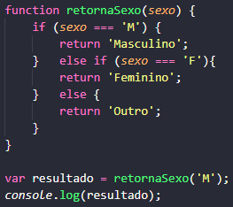
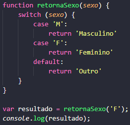
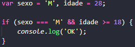
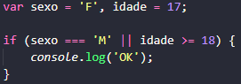
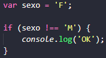
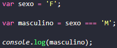
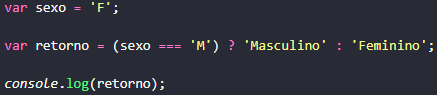

<h1 align="center">
    
</h1>

<h4 align="center"> 
  :memo: "A tinta mais fraca..." Já sabem o resto, né? :nerd_face:
</h4>

<p align="center">
    <a href="https://github.com/Raphael-GC/Skylab_JS/stargazers">
        
    </a>
    <a href="https://github.com/Raphael-GC/Skylab_JS/commits/master">
        
    </a>
    
    
</p>

<p align="center">
  <a href="#bulb-a-ideia">A Ideia</a>&nbsp;&nbsp;&nbsp;|&nbsp;&nbsp;&nbsp;
  <a href="#ballon-git">Git</a>&nbsp;&nbsp;&nbsp;|&nbsp;&nbsp;&nbsp;
  <a href="#gear-javascript">JS</a>&nbsp;&nbsp;&nbsp;|&nbsp;&nbsp;&nbsp;
  <a href="#eyeglasses-html">HTML</a>&nbsp;&nbsp;&nbsp;|&nbsp;&nbsp;&nbsp;
  <a href="#art-css">CSS</a>
</p>

<br>

## :bulb: A Ideia

Decidi registrar todas as minhas dúvidas e lições aprendidas durante o curso, no intuito de mensurar a curva de aprendizado obtida.

## :balloon: Git e Markdown

```bash
# Como criar e subir um repositório para o github pelo terminal.
$ echo "# Skylab_JS" >> README.md
$ git init
$ git add README.md
$ git commit -m "Primeiro commit"
$ git remote add origin git@github.com:Raphael-GC/Skylab_JS.git
$ git push -u origin master
```
```bash
# Comentários em MD.
[//]: <> (Exemplo de como comentar em Markdown)
```


## :gear: Javascript

```bash
# ERRO.1 : "Uncaught SyntaxError: Invalid shorthand property initializer"
# Esse erro foi exibido no console do navegador ao testar arquivo index.html 
# Lição E1: Em JS usamos ':' e não '=' para atribuir valor à uma propriedade de objeto; e finalizamos a linha com ',' ao #invés de  ';' 
 var aluno = {
      nome : 'Raphael',
      idade : 28,
      peso : 72.5,
      humano : true,
 };

_______________________________________________________________________________________________________________________________________

# Lição N1: Em JS usamos '===' quando além de comparar o valor de uma variável, compararmos o tipo.
 if (1 === "1")
# Neste exemplo o resultado seria: 'false' 
```
**Aula 06 - Condicionais**:

- If, Else If e Else


- Switch


**Aula 07 - Operadores Lógicos**:

- And
```sh
# Verifica se há igualdade em todas as informações propostas. Usamos o '&&' para representá-lo.
```


- Or
```sh
# Verifica se há igualdade em alguma das informações propostas. Usamos o '||' para representá-lo.
```


- Not
```sh
# Verifica se há uma desigualdade nas informações propostas. Usamos o '!==' para representá-lo.
```


- Enxugando Ifs desnecessários
```sh
# Desta forma, atribuimos uma condição como valor para uma variável, diminuindo a verbosidade do código.
```


- Condição Ternária
```sh
# Mais um exemplo de redução da verbosidade do código.
```



## :eyeglasses: HTML

```bash
# 
$
```

## :art: CSS

```bash
# 
$
```
---