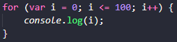
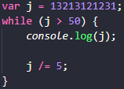
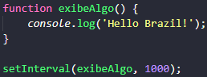
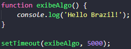

<h1 align="center">
    
</h1>

<h4 align="center"> 
  :memo: "A tinta mais fraca..." Já sabem o resto, né? :nerd_face:
</h4>

<p align="center">
    <a href="https://github.com/Raphael-GC/Skylab_JS/stargazers">
        
    </a>
    <a href="https://github.com/Raphael-GC/Skylab_JS/commits/master">
        
    </a>
    
    
</p>

<p align="center">
  <a href="#bulb-a-ideia">A Ideia</a>&nbsp;&nbsp;&nbsp;|&nbsp;&nbsp;&nbsp;
  <a href="#ballon-git">Git</a>&nbsp;&nbsp;&nbsp;|&nbsp;&nbsp;&nbsp;
  <a href="#gear-javascript">JS</a>&nbsp;&nbsp;&nbsp;|&nbsp;&nbsp;&nbsp;
  <a href="#eyeglasses-html">HTML</a>&nbsp;&nbsp;&nbsp;|&nbsp;&nbsp;&nbsp;
  <a href="#art-css">CSS</a>
</p>

<br>

## :bulb: A Ideia

Decidi registrar todas as minhas dúvidas e lições aprendidas durante minha jornada nos cursos da Rocketseat, no intuito de mensurar a curva de aprendizado obtida. As aulas mencionadas fazem parte da trilha Starter, que é o curso gratuito da Rocketseat. Já as lições registradas neste arquivo, são do meu aprendizado como um todo, tanto na trilha Starter quanto na trilha LaunchBase. Dentro de cada linguagem, o conteúdo é registrado de forma cronológica ao meu aprendizado e não especificamente na ordem em que é apresentado.

## :balloon: Git e Markdown

Como criar e subir um repositório para o github pelo terminal.
```bash
$ echo "# Skylab_JS" >> README.md
$ git init
$ git add README.md
$ git commit -m "Primeiro commit"
$ git remote add origin git@github.com:Raphael-GC/Skylab_JS.git
$ git push -u origin master
```

Comentários em MarkDown:
```markdown
[//]: <> (Aqui vai o comentário)
```


## :gear: Javascript

### :warning: ERRO
N1 : "Uncaught SyntaxError: Invalid shorthand property initializer"
Esse erro foi exibido no console do navegador ao testar arquivo index.html 

:seedling: Em JS usamos ':' e não '=' para atribuir valor à uma propriedade de objeto; e finalizamos a linha com ',' ao #invés de  ';' 
```javascript
 var aluno = {
      nome : 'Raphael',
      idade : 28,
      peso : 72.5,
      humano : true,
 };
```

### :book: Lição 
N1: Em JS usamos '===' quando além de comparar o valor de uma variável, compararmos o tipo.
```javascript
 if (1 === "1")
```
Neste exemplo o resultado seria: 'false'

**Aula 06 - Condicionais**:

- If, Else If e Else


- Switch


**Aula 07 - Operadores Lógicos**:

- And
```sh
# Verifica se há igualdade em todas as informações propostas. Usamos o '&&' para representá-lo.
```


- Or
```sh
# Verifica se há igualdade em alguma das informações propostas. Usamos o '||' para representá-lo.
```


- Not
```sh
# Verifica se há uma desigualdade nas informações propostas. Usamos o '!==' para representá-lo.
```


- Enxugando Ifs desnecessários
```sh
# Desta forma, atribuimos uma condição como valor para uma variável, diminuindo a verbosidade do código.
```


- Condição Ternária
```sh
# Mais um exemplo de redução da verbosidade do código.
```


**Aula 09 - Estruturas de Repetição**:

- For
```sh
# Melhor utilizado quando se sabe quantas vezes se deseja repetir aquele bloco de código.
```


- While
```sh
# Melhor utilizado quando NÃO se sabe quantas vezes aquele bloco de código irá se repetir.
```


**Aula 10 - Intervalo e Timeout**:

- Interval
```sh
# Repete a função a cada período de tempo, passados como parâmetros respectivamente.
```


- Timeout
```sh
# Atrasa a execução da função de acordo com período de tempo informado.
```


**Exercícios (somente respostas)**: [Questões](.github/examples/Exercícios.pdf)

- 1º exercício
```javascript
var endereco = {
    rua: "Rua dos pinheiros",
    numero: 1293,
    bairro: "Centro",
    cidade: "São Paulo",
    uf: "SP"
};
            
function exibicao() {
    console.log('O usuário mora em ' + endereco.cidade + ' / ' + endereco.uf + ', no bairro ' + endereco.bairro + ', na rua ' + '"' + endereco.rua + '" ' + 'com o n° ' + endereco.numero + '.');
};

exibicao();
```


### :book: Lição 
N2: Em JS, chamamos Template Strings, quando o texto esta envolvido por acentos graves, ao inves de aspas simples ou duplas. Se distingue das demais por permitir a inclusao de variaveis dentro de seu escopo.
```javascript
const nome = "Rapha"
const nome2 = 'Jose'
const nome3 = `Samuel e ${nome}`  //--> Template String

console.log(nome3)
```

### :book: Lição
N3: Hoje aprendi uma nova maneira de escrever a estrutura de repetição For. No exemplo abaixo, ele está sendo utilizado para percorrer um array de alunos. Onde, de forma ele inteligente, ele repetirá a verificação de acordo com o tamanho do array passado como parâmetro. E também, conheci o console.table, que é uma forma muito mais apresentável de exibir o resultado dessa função do exemplo.
```javascript
function marcarComoReprovado(alunos) {
    for (let aluno of alunos) {
        aluno.reprovado = false;
        if (aluno.nota < 5) {aluno.reprovado = true}
    }
    console.table(alunos)
}
```
## :eyeglasses: HTML

```bash
# 
$
```

## :art: CSS

```bash
# 
$
```
---
